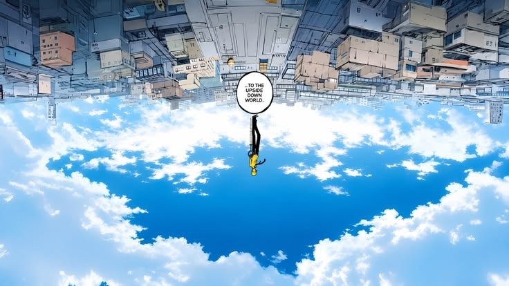
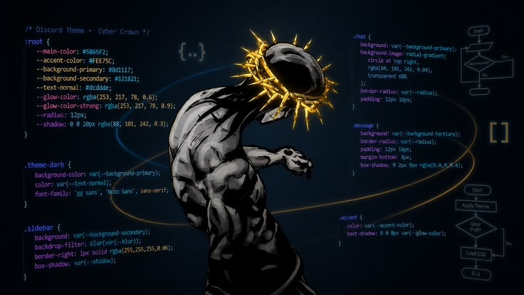

<div align="center">



<br/>


</div>

<br/>

---

### 🖤 Sobre mí

<table>
<tr>
<td width="55%" valign="top">

```js
const yeimiry = {
  rol: "Diseñadora web junior",
  ubicación: "Costa Rica 🇨🇷",
  estudios: "INA — Desarrollo Web",

  aprendiendo: [
    "CSS avanzado",
    "JavaScript vanilla",
    "diseño UI/UX",
  ],

  construyendo: "mi primer web template premium",

  frase: "No está mal aprender cosas nuevas.",
};
```

</td>
<td width="45%">

</td>
</tr>
</table>

<br/>

---

### 🔗 Connect With Me

<p align="center">
<a href="mailto:culquiorra74@gmail.com">
  
</a>
<a href="https://instagram.com/subaru.balse" target="_blank">
  
</a>
<a href="https://github.com/ItsYeimiry" target="_blank">
  
</a>
</p>

<br/>

---

### 🛠️ Tech Stack

<p align="center">

</p>

<br/>

---

### ✨ Actualmente

🎓 &nbsp;Estudiando desarrollo web en el INA
🧩 &nbsp;Construyendo mi primer web template premium
📖 &nbsp;Aprendiendo CSS avanzado y JavaScript vanilla

<br/>

---

### 📊 GitHub Analytics

<p align="center">


</p>

<p align="center">

</p>

<p align="center">

</p>

<br/>

---

<div align="center">


*✦ &nbsp; made with curiosity & a lot of css &nbsp; ✦*

</div>
